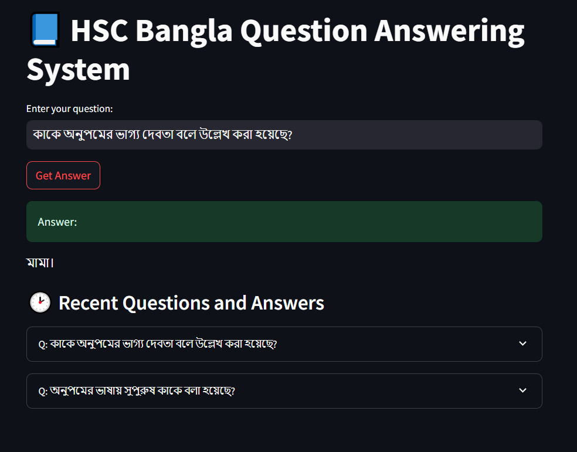
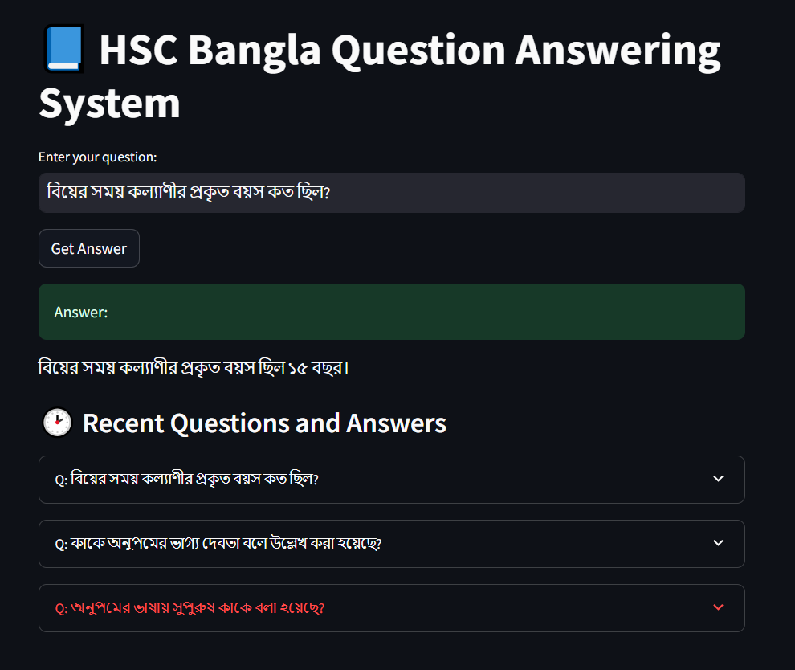

# HSC Bangla Question Answering System

An intelligent QA system built to answer questions about HSC Bangla content using Google's Gemini AI.

## Setup Guide

1. Clone the repository
```bash
git clone <repository-url>
cd 10ms_assignment
```

2. Install dependencies
```bash
pip install -r requirements.txt
```

3. Create a `.env` file and add your Google API key
```bash
GOOGLE_API_KEY=your_api_key_here
```

4. Run the application
```bash
streamlit run app.py
```

## Tools & Technologies

- **Framework**: Streamlit
- **Language Model**: Google Gemini 2.5 Flash
- **Vector Store**: FAISS
- **Embeddings**: Google Generative AI Embeddings
- **PDF Processing**: PyPDF2
- **Text Processing**: LangChain

## Key Features

- Bilingual support (Bangla & English)
- PDF document processing
- Vector similarity search
- Conversation history
- User-friendly interface

## Sample Queries & Outputs

### Bangla Queries
Q: "অনুপমের ভাষায় সুপুরুষ কাকে বলা হয়েছে?"
A: শুম্ভুনাথ

Q: "কাকে অনুপমের ভাগ্য দেবতা বলে উল্লেখ করা হয়েছে?"
A: মামাকে

Q: "বিয়ের সময় কল্যাণীর প্রকৃত বয়স কত ছিল?"
A: ১৫ বছর

### Sample Screenshots

#### Main Interface





*The main application interface showing the question input area and response section*


## System Architecture

1. **Document Processing**
   - PDF text extraction
   - Text chunking
   - Embedding generation

2. **Query Processing**
   - Question embedding
   - Similarity search
   - Context retrieval
   - Answer generation

## Limitations & Future Improvements

- Currently supports single PDF document
- Limited to text-based QA
- Future scope:
  - Multiple document support
  - Image-based questions
  - Enhanced context understanding
  - API integration

## Performance Metrics

- Average response time: ~2-3 seconds
- Context retrieval accuracy: Based on vector similarity
- Answer relevance: Determined by Gemini model
- Memory usage: ~500MB-1GB depending on document size

## License

[Add your license information]


# Technical Details for HSC Bangla Gemini RAG QA System

### 1️⃣ What method or library did you use to extract the text, and why? Did you face any formatting challenges with the PDF content?

Used **PyPDF2 (`PdfReader`)** for text extraction as it is lightweight and easy to integrate.
Faced **minor formatting issues** (line breaks loss, headers/footers mixed), but acceptable for QA over Bangla HSC PDFs.

---

### 2️⃣ What chunking strategy did you choose (e.g., paragraph-based, sentence-based, character limit)? Why do you think it works well for semantic retrieval?

Used **character-based chunking**:

* `chunk_size = 10,000`
* `chunk_overlap = 1,000`

✅ Works well because it preserves **large context for QA**, prevents context loss across boundaries, and is **language-agnostic** (Bangla & English).

---

### 3️⃣ What embedding model did you use? Why did you choose it? How does it capture the meaning of the text?

Used:

```python
GoogleGenerativeAIEmbeddings(model="models/embedding-001")
```

✅ Chosen for **strong semantic embeddings**, cross-lingual support, and seamless Gemini pipeline integration, capturing meaning beyond keywords for retrieval.

---

### 4️⃣ How are you comparing the query with your stored chunks? Why did you choose this similarity method and storage setup?

Used **FAISS vector store** with semantic **similarity search**:

```python
vector_store.similarity_search(user_question)
```

✅ Chosen for **fast, local semantic retrieval** over large text corpus with minimal latency.

---

### 5️⃣ How do you ensure that the question and the document chunks are compared meaningfully? What would happen if the query is vague or missing context?

Using **embedding-based similarity ensures semantic comparison** between questions and chunks, independent of exact keywords.
If the query is vague or lacks context, it retrieves the closest semantically related chunks, which may lead to **less relevant answers**.

---

### 6️⃣ Do the results seem relevant? If not, what might improve them?

The results are **reasonably relevant for direct Bangla HSC QA**.
To improve further:

* Better chunking (sentence/paragraph with metadata)
* Using **BGE-m3 embeddings** for stronger cross-lingual capture
* Adding more documents for broader retrieval

---
